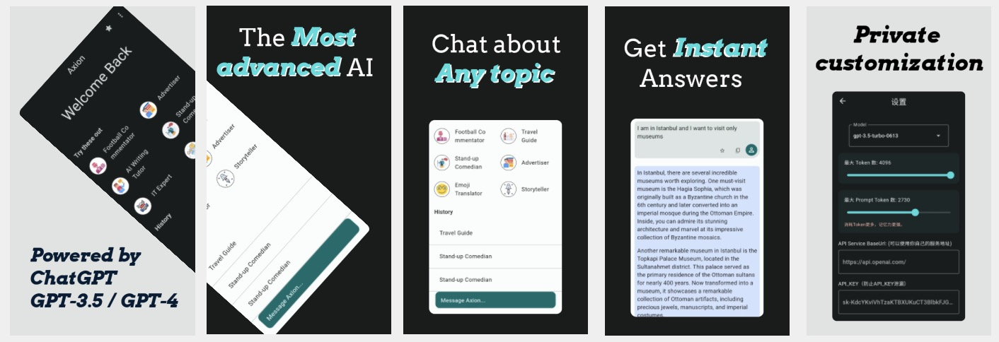

# OpenChatGPT

A fully open-source, cross-platform ChatGPT client. Supporting **Android** / **iOS** / **macOS** / **Windows** / **Linux** / **Fuchsia** .

[**中文支持**](./README-zh.md)

## Overview

Due to OpenAI's restrictions in certain countries, many people are unable to conveniently access the **ChatGPT** client. To address this issue, I have developed a fully open-source solution. It includes a client implemented using **Flutter** and a [**server**](https://github.com/nb7123/OpenChatGPT-server) program implemented in **Go**, which can help these users overcome this limitation. You can also customize and build personalized applications for your own team or yourself.

You are free to use all the code here.

The client can be used independently, but to prevent your **API_KEY** from being leaked, it is recommended to deploy the corresponding server program (link to deployment here), and then configure your own server to use the **API_KEY**.

Please refer to the server-side program [**here**](https://github.com/nb7123/OpenChatGPT-server).

* If you need excellent **Prompt**, you can refer to [**here**](https://github.com/f/awesome-chatgpt-prompts).



## Environment

The client is implemented using **Flutter**, therefore, before building, you need to configure your development environment properly.

You can also directly use our released [**Axion**](https://www.easy-ai.us/) 😊😊😊.

[**Flutter**](https://docs.flutter.dev/get-started/install) environment.。

[**Go**](https://go.dev/doc/install) environment。

### Build

**Android (APK)**　Please refer to the [**official documentation**](https://docs.flutter.dev/deployment/android) for detailed build instructions.

```
flutter build apk
```

**iOS** Please refer to the [**official documentation**](https://docs.flutter.dev/deployment/ios) for detailed build instructions.

```
flutter build ipa
```

**macOS** Please refer to the [**official documentation**](https://docs.flutter.dev/deployment/macos) for detailed build instructions.

```
flutter build macos
```

**Windows** Please refer to the [**official documentation**](https://docs.flutter.dev/deployment/windows) for detailed build instructions.

```
flutter build windows
```

**Linux** Please refer to the [**official documentation**](https://docs.flutter.dev/deployment/linux) for detailed build instructions.

If you are not a professional developer, you can simply use our released app to support us.

 [**Axion**](https://www.easy-ai.us/) 😊😊😊.

## Contribution

Welcome to contribute code.

## Licence

Completely **Free** to use.

## FAQ

Welcome to submit feedback in the issue section.

## Contact Me

* **Email**: nb7123@gmail.com
* [**Twitter**](https://twitter.com/harrys_hemmings?t=yn91b_EqsgFOZu8QpY_hRA&s=05)

## Thank you for your support

Welcome to use  our product [**Axion**](https://www.easy-ai.us/)

 

[**Google Play**](https://play.google.com/store/apps/details?id=com.easyai.chat)

 

[**Apple Store**](https://apps.apple.com/cn/app/axion-powerful-ai-chatbot/id6452236314)